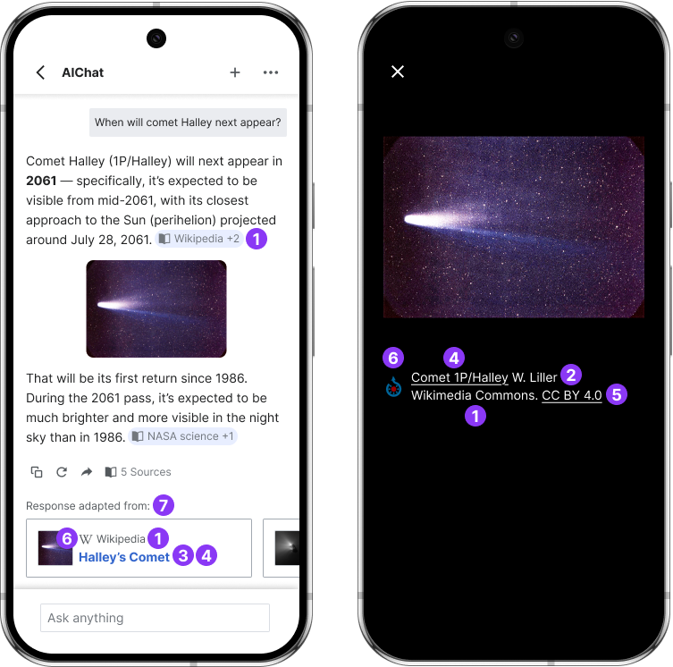

# AI assistants

AI-powered chatbots and agents increasingly serve as an intermediary between users and knowledge. Unlike traditional search results, answers often blend information from multiple sources into a single conversation, making attribution more challenging but also vital.

We prioritized this scenario because Wikimedia content is already widely used as a source in LLM systems. Ensuring attribution in conversational contexts will ensure proper credit for our community of contributors, help preserve transparency, and highlight Wikimedia as a trusted source of human-curated information in the age of AI.

## Essential attribution

In conversational interfaces, where answers are often blended from multiple sources, basic attribution ensures that users can clearly identify when knowledge comes from Wikimedia projects. Every mention of Wikimedia content should provide transparent source information, a path back to the original page, and required license or modification details, when applicable. These elements establish Wikimedia as a visible and verifiable source within AI-generated dialogue.

1. [Source](#source) • 2. [Author](#author) • 3. [Link](#link) • 4. [Title](#title) • 5. [License](#license) • 6. [Brand mark](#brand-mark) · 7. [Modification disclaimer](#modification-disclaimer)

> **Note**: All the illustrations provided are only for orientation. Reusers may adjust the appearance of the signals to follow their design guidelines and their context’s visual style in order to ensure consistency.

____

### 1. Source {#source}

`Required`

Identify the Wikimedia project from which the information originates. Use text or, exceptionally, the project’s brand mark (see 6) if space is limited.
[See full signal spec →]((../attribution-signals/source.html))

**Data sources**:
- Available through URL parsing
- [Static sitematrix endpoint in Meta Wikimedia](https://meta.wikimedia.org/w/api.php?action=sitematrix&format=json)

- [Wikimedia Enterprise API](https://enterprise.wikimedia.com/docs/#getting-started)

**High visibility on wiki.** This signal is immediately visible at the source.

### 2. Author {#author}

`Required` based on license

When displaying media files (e.g., from Wikimedia Commons) in result pages, it’s important to state or provide direct access to information about the author. [See full signal spec →](../attribution-signals/author.html)

**Data sources**:

- [MediaWiki Action API](https://www.mediawiki.org/wiki/API:Action_API) (Allows retrieving the author of Commons media files)

**Mixed visibility on wiki.** The visibility of this information varies per project. For example, it's immediately visible in Wikimedia Commons' file pages, but requires reviewing articles' history on Wikipedia.

### 3. Link {#link}

`Required`

Provide direct access to the specific Wikimedia project pages used to generate the assistant’s response or containing related information. [See full signal spec →](../attribution-signals/link.html)

**Data sources**:

- [MediaWiki Action API](https://www.mediawiki.org/wiki/API:Action_API)

- [MediaWiki REST API](https://www.mediawiki.org/wiki/API:REST_API)

- [Wikimedia Enterprise API](https://enterprise.wikimedia.com/docs/#getting-started)

**High visibility on wiki.** This information is immediately visible at the source.

### 4. Title {#title}

`Required`

Identify the name of the Wikimedia pages being used as sources. This is key for users to identify relevant subsequential reading. [See full signal spec →](../attribution-signals/title.html)

**Data sources**:

- Available through URL parsing

- [Wikimedia Enterprise API](https://enterprise.wikimedia.com/docs/#getting-started)

**High visibility on wiki.** This information is immediately visible at the source.

### 5. License {#license}

`Required` by license type

You must find an appropriate way to indicate the license of reused content. Particularly required if the license implies any usage restrictions. [See full signal spec →](../attribution-signals/license.html)

**Data sources**:

- [MediaWiki Action API](https://www.mediawiki.org/wiki/API:Action_API)

- [Wikimedia Enterprise API](https://enterprise.wikimedia.com/docs/#getting-started)

**High visibility on wiki.** This information is immediately visible at the source.

### 6. Brand mark {#brand-mark}

`Required` if the Source isn't stated

Use brand marks to visually identify the source of the information being reused. Might replace the source when space is limited. [See full signal spec →](../attribution-signals/brand-mark.html)

**Data sources**:

- Visual brand marks: [Wikimedia Commons](https://commons.wikimedia.org/wiki/Category:Wikimedia_Attribution_Guide_Favicons) categorizes brand favicons aligned with Wikimedia identity guidelines

- Audio brand marks: The [Meta Wikimedia](https://meta.wikimedia.org/wiki/Brand/logo#Wikimedia_Sound_Logo) platform hosts information and audio files that allow implementing the Wikimedia sound logo

**High visibility on wiki.** This information is immediately visible at the source.

### 7. Modification disclaimer  {#modification-disclaimer}

`Required`

We recommend displaying disclaimers to indicate that AI-generated content is produced aggregating several sources (left image).

In contrast, under no circumstances should aggregate content be attributed to a single source (right image).

[See full signal spec →](../attribution-signals/modification-disclaimer.html)

--- {.clear}

## Trust and relevance

`Recommended` signals

For AI responses to be credible, users need more than a simple citation. Trust signals such as reference counts, contributor activity, and readership data demonstrate that Wikimedia knowledge is the product of collective review and active use. Highlighting these attributes within chatbot responses reinforces both the reliability of the information and the integrity of the conversational system presenting it.

### Reference count

Use this Wikipedia-specific credibility signal to expose the number of sources backing an article’s content. [See full signal spec →](../attribution-signals/reference-count.html)

**Data sources**:

- [MediaWiki REST API](https://www.mediawiki.org/wiki/API:REST_API)

**Medium visibility on wiki.** This information is verifiable when articles contain numbered reference lists.

### Contributor count

This trust signal indicates the number of volunteers that have contributed to create or gather the information available in the original Wikimedia project page. [See full signal spec →](../attribution-signals/contributor-count.html)

**Data sources**:

- [Wikimedia dumps](https://dumps.wikimedia.org/)

- [MediaWiki REST API](https://www.mediawiki.org/wiki/API:REST_API)

- [MediaWiki Action API](https://www.mediawiki.org/wiki/API:Action_API)

**Medium visibility on wiki.** This information is visible, but requires accessing a data dashboard from articles' Revision history.

### Page views

Use this signal to express the total number of views that a specific Wikimedia page has received in a predefined period of time. [See full signal spec →](../attribution-signals/page-views.html)

**Data sources**:

- [Wikimedia dumps](https://dumps.wikimedia.org/)

- [Wikimedia Analytics API](https://doc.wikimedia.org/generated-data-platform/aqs/analytics-api/reference/page-views.html#get-number-of-page-views-for-a-page)

**Medium visibility on wiki.** This information is visible, but requires accessing a data dashboard from articles' Revision history.

### Attribution count

Use this signal to indicate that a Wikipedia (or other Wikimedia) source is both frequently reused and actively referenced within the LLM’s ecosystem. [See full signal spec →](../attribution-signals/attribution-count.html)

### Trending indicator

Use this attribute to flag Wikipedia articles that are experiencing an unusual volume of recent activity, such as sharp increases in reads and/or edits that often correlate with unfolding events. [See full signal spec →](../attribution-signals/trending-indicator.html)

**Data sources**:

`Coming soon`

**No visibility on wiki.** This information is currently not available on Wikimedia pages.

### Last update

Use this attribute to indicate the most recent update of a Wikimedia page as a  timestamp (e.g., “Last update 22 September 2025”) or a relative format (“Updated 3 minutes ago”). [See full signal spec →](../attribution-signals/last-update.html)

**Data sources**:

- [MediaWiki REST API](https://www.mediawiki.org/wiki/API:REST_API)

- [MediaWiki Action API](https://www.mediawiki.org/wiki/API:Action_API)

- [Wikimedia Enterprise API](https://enterprise.wikimedia.com/docs/#getting-started)

**Medium visibility on wiki.** This information is available in pages' history (requires navigation).

## Ecosystem growth

`Recommended`

Conversational systems should not only reuse, but also help sustain the renewal of the knowledge they depend on. A participation call-to-action (CTA) embedded in responses or source panels could facilitate the transition of users from consumers to contributors. By creating visible paths back to editing and engagement, AI agents can play a role in keeping the cycle of free knowledge active and inclusive.

### Participation CTA

Use participation CTAs to provide context-appropriate prompts to invite your audience to contribute to the Wikimedia ecosystem. [See full signal spec →](../attribution-signals/participation-cta.html)
