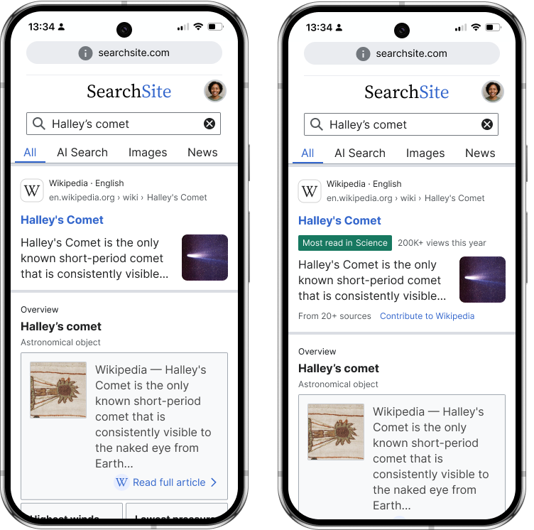
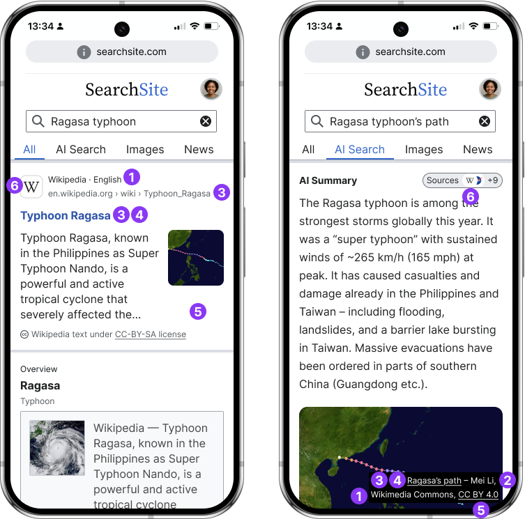

# Search

Search engines are one of the most visible and common ways people encounter Wikimedia content. Whether on classic result pages or AI-generated overviews, Wikipedia and its sister projects commonly stand as a fundamental source of the information provided to search engine users.

Search platforms amplify Wikimedia’s reach, and are a primary gateway to free knowledge for billions of people worldwide. Consistent attribution in this scenario is necessary not only to safeguard the visibility of our projects as a source of high-quality content, but also to ensure reciprocity.

<WikipediaAttributionDemo />

<!---

*Mockup of a Search engine results page displaying minimal (left) and a combination of essential and recommended attribution signals (right)*

> **Note** All the illustrations provided are only for orientation. Reusers may adjust the appearance of the signals to follow their design guidelines and their context’s visual style in order to ensure consistency. -->

## Essential attribution

At the most basic level, when Wikimedia content appears in search results (whether as classic snippets or AI-generated summaries) it should always be clearly attributed. This means identifying Wikimedia as the source, linking back to the original page, and displaying the title and other elements as required by the content’s license and any modifications applied to it. 

Essential signals safeguard visibility for the volunteer-created projects that power the information delivered by search engines. They provide users with a transparent path to verify, explore, and potentially engage with the ecosystem where the knowledge originated.

1. [Source](#source) • 2. [Author](#author) • 3. [Link](#link) • 4. [Title](#title) • 5. [License](#license) • 6. [Brand mark](#brand-mark)

<!-- • 7. [Modification disclaimer](#modification-disclaimer)*-->

> **Note** All the illustrations provided are only for orientation. Reusers may adjust the appearance of the signals to follow their design guidelines and their context’s visual style in order to ensure consistency. 

____

### 1. Source {#source}

`Required`

Identify the Wikimedia project from which the information originates. Use text or, exceptionally, the project’s brand mark (see 6) if space is limited.
[See full signal spec →]((../attribution-signals/source.html))

**Data sources**:
- Available through URL parsing
- [Static sitematrix endpoint in Meta Wikimedia](https://meta.wikimedia.org/w/api.php?action=sitematrix&format=json)
- [Wikimedia Enterprise API](https://enterprise.wikimedia.com/docs/#getting-started)

**High visibility on wiki.** This signal is immediately visible at the source.

### 2. Author {#author}

`Required` based on license

When displaying media files (e.g., from Wikimedia Commons) in result pages, it's important to state or provide direct access to information about the author. [See full signal spec →](../attribution-signals/author.html)

**Data sources**:
- [MediaWiki Action API](https://www.mediawiki.org/wiki/API:Action_API) (Allows retrieving the author of Commons media files)

**Mixed visibility on wiki.** The visibility of this information varies per project. For example, it's immediately visible in Wikimedia Commons' file pages, but requires reviewing articles' history on Wikipedia.

### 3. Link {#link}

`Required`

Provide direct access to the specific Wikimedia project page where the content in the results is being drawn from. [See full signal spec →](../attribution-signals/link.html)

**Data sources**:
- [MediaWiki Action API](https://www.mediawiki.org/wiki/API:Action_API)
- [MediaWiki REST API](https://www.mediawiki.org/wiki/API:REST_API)
- [Wikimedia Enterprise API](https://enterprise.wikimedia.com/docs/#getting-started)

**High visibility on wiki.** This information is immediately visible at the source.

### 4. Title {#title}

`Required`

Identify the name of the media or source page being retrieved. This is key for search engine users to identify relevance. [See full signal spec →](../attribution-signals/title.html)

**Data sources**:
- Available through URL parsing
- [Wikimedia Enterprise API](https://enterprise.wikimedia.com/docs/#getting-started)

**High visibility on wiki.** This information is immediately visible at the source.

### 5. License {#license}

`Required` by license type

You must find an appropriate way to indicate the license of reused content. Particularly required if the license implies any usage restrictions. [See full signal spec →](../attribution-signals/license.html)

**Data sources**:
- [MediaWiki Action API](https://www.mediawiki.org/wiki/API:Action_API)
- [Wikimedia Enterprise API](https://enterprise.wikimedia.com/docs/#getting-started)

**High visibility on wiki.** This information is immediately visible at the source.

### 6. Brand mark {#brand-mark}

`Required` if the Source isn't stated

Use brand marks to visually identify the source of the information being reused. Might replace the source when space is limited. [See full signal spec →](../attribution-signals/brand-mark.html)

**Data sources**:
- Visual brand marks: [Wikimedia Commons](https://commons.wikimedia.org/wiki/Category:Wikimedia_Attribution_Guide_Favicons) categorizes brand favicons aligned with Wikimedia identity guidelines
- Audio brand marks: The [Meta Wikimedia](https://meta.wikimedia.org/wiki/Brand/logo#Wikimedia_Sound_Logo) platform hosts information and audio files that allow implementing the Wikimedia sound logo

**High visibility on wiki.** This information is immediately visible at the source.

### 7. Modification disclaimer  {#modification-disclaimer}

`Required`

Modifications or additions made to Wikimedia content or media files need to be announced in a way that fits the medium. 
We recommend displaying disclaimers associated to aggregated content too, such as the one produced by AI search assistants (left image). 

Under no circumstances should aggregate content be attributed to a single source (right image).

[See full signal spec →](../attribution-signals/modification-disclaimer.html)

--- {.clear}

## Trust and relevance

`Recommended` signals

Beyond essential attribution, search results should help users assess the reliability of the information being surfaced. Signals such as reference counts, editor activity, or readership data make visible the processes of review, participation, and use that underpin Wikimedia projects. Highlighting these cues strengthens the credibility of both the content and the platform reusing it, while guiding audiences toward sources they can trust.

### Reference count 

Use this Wikipedia-specific credibility signal to expose the number of sources backing an article’s content.
[See full signal spec →](../attribution-signals/reference-count.html)

**Data sources**:
- [MediaWiki REST API](https://www.mediawiki.org/wiki/API:REST_API)

**Medium visibility on wiki.** This information is verifiable when articles contain numbered reference lists.

### Contributor count 

This Wikipedia-specific trust signal indicates the number of volunteers that have contributed to create or gather the information available in the original Wikimedia project page.
[See full signal spec →](../attribution-signals/contributor-count.html)

**Data sources**:
- [Wikimedia dumps](https://dumps.wikimedia.org/)
- [MediaWiki REST API](https://www.mediawiki.org/wiki/API:REST_API)
- [MediaWiki Action API](https://www.mediawiki.org/wiki/API:Action_API)

**Medium visibility on wiki.** This information is visible, but requires accessing a data dashboard from articles' Revision history.

### Page views 

Use this signal to express the total number of views that a specific Wikimedia page has received in a predefined period of time. [See full signal spec →](../attribution-signals/page-views.html)

**Data sources**:
- [Wikimedia dumps](https://dumps.wikimedia.org/)
- [Wikimedia Analytics API](https://doc.wikimedia.org/generated-data-platform/aqs/analytics-api/reference/page-views.html#get-number-of-page-views-for-a-page)

**Medium visibility on wiki.** This information is visible, but requires accessing a data dashboard from articles' Revision history.

### Attribution count 

Use this signal to indicate (numerically or not) the popularity of a specific resource in your system, based (for example) on the number of impressions. [See full signal spec →](../attribution-signals/attribution-count.html)

### Trending indicator 

Use this attribute to flag Wikipedia articles that are experiencing an unusual volume of recent activity, such as sharp increases in reads and/or edits that often correlate with unfolding events. [See full signal spec →](../attribution-signals/trending-indicator.html)

**Data sources**:
- Coming soon...

**No visibility on wiki.** This information is currently not available on Wikimedia pages.

### Last update 

Use this attribute to display the timestamp of the most recent edit done to the Wikimedia page being retrieved or reused (e.g., “Last update 22 September 2025”). [See full signal spec →](../attribution-signals/last-update.html)

**Data sources**:
- [MediaWiki REST API](https://www.mediawiki.org/wiki/API:REST_API)
- [MediaWiki Action API](https://www.mediawiki.org/wiki/API:Action_API)
- [Wikimedia Enterprise API](https://enterprise.wikimedia.com/docs/#getting-started)

**Medium visibility on wiki.** This information is available in pages' history (requires navigation).

## Ecosystem growth

`Recommended`

Attribution is not only about recognizing past contributions but also about sustaining the future of free knowledge. By including a clear participation call-to-action (CTA) in search results, reusers can help close the loop. Inviting audiences who benefit from Wikimedia content to also contribute back. This intervention supports the continued growth and renewal of Wikimedia projects, ensuring that the knowledge surfaced today keeps being enriched and expanded by volunteers tomorrow.

### Participation CTA 

Use participation CTAs to provide context-appropriate prompts to invite your audience to contribute to the Wikimedia ecosystem. [See full signal spec →](../attribution-signals/participation-cta.html)

